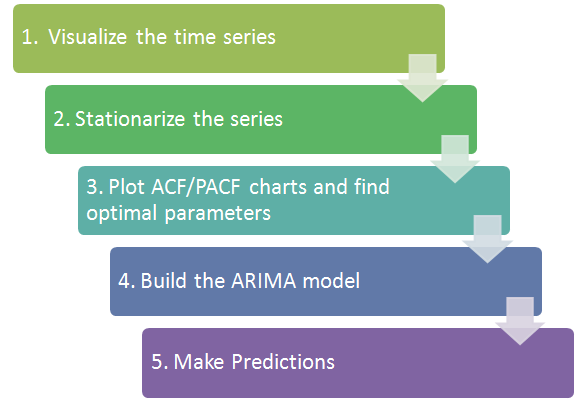

# A technical data analysis.

### Dataset Links
- [Air Passengers](https://www.kaggle.com/rakannimer/air-passengers) 

### Predictive Analytics (TimeSeries)

  
   
    <i>Photo credits to the original uploader.</i>

#### ARIMA
- [ARIMA model, AirPassengers dataset](https://github.com/kankaungmalay/a_technical_analysis/blob/main/scripts/predictive_analytics/time_series_forecasting_%5BM%5DARIMA_%5BD%5Dairpassengers.ipynb)

#### Prophet
- [Prophet, AirPassengers](https://github.com/kankaungmalay/a_technical_analysis/blob/main/scripts/predictive_analytics/time_series_forecasting_%5BM%5DProphet_%5BD%5Dairpassengers.ipynb)

#### SARIMA
- [SARIMA model, AirPassengers](https://github.com/kankaungmalay/a_technical_analysis/blob/main/scripts/predictive_analytics/time_series_forecasting_%5BM%5DSARIMA_%5BD%5Dairpassengers.ipynb)

- [SARIMA model, Co2](https://github.com/kankaungmalay/a_technical_analysis/blob/main/scripts/predictive_analytics/time_series_forecasting_%5BM%5DSARIMA_%5BD%5Dco2%20.ipynb)

- [SARIMA model, Sunspots](https://github.com/kankaungmalay/a_technical_analysis/blob/main/scripts/predictive_analytics/time_series_forecasting_%5BM%5DSARIMA_%5BD%5Dsunspots.ipynb)

### Deep Learning

- [LSTM(RNN), AirPassengers](https://github.com/kankaungmalay/a_technical_analysis/blob/main/scripts/deep_learning/DL_time_series_forecasting_%5BM%5DLSTM_%5BD%5Dairpassengers.ipynb)
